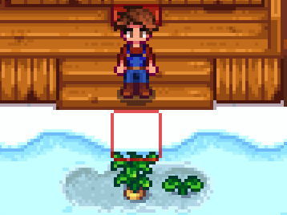

**All Crops All Seasons** is a [Stardew Valley](http://stardewvalley.net/) mod which lets you grow
crops in any season, including winter:
> 

Compatible with Stardew Valley 1.11+ on Linux, Mac, and Windows. Originally written by cantorsdust,
and now maintained by the community — pull requests are welcome!

## Contents
* [Install](#install)
* [Use](#use)
* [Versions](#versions)
* [See also](#see-also)

## Install
1. [Install the latest version of SMAPI](http://canimod.com/for-players/install-smapi).
2. Install [this mod from Nexus mods](http://www.nexusmods.com/stardewvalley/mods/170).
3. Replace `Content\Data\Crops.xnb` with the included `Crops.xnb` file.
4. Run the game using SMAPI.

## Use
Just install the mod and play the game. You'll be able to plant and harvest crops in any season,
and your crops will be saved each night. This mod does _not_ change store inventories, so you can
only buy crop seeds during their usual seasons.

## Versions
### 1.0
* Initial release.

### 1.1
* Updated for SMAPI 0.39.

### 1.2
* Updated for SMAPI 1.0+ and Stardew Valley 1.1.
* Added support for new coffee plant.

### 1.3
* Updated for SMAPI 1.9+ and Stardew Valley 1.2.
* Internal refactoring.
* Fixed issue where crops don't grow if you go to bed without leaving the farmhouse.

## See also
* [Nexus mod](http://www.nexusmods.com/stardewvalley/mods/170)
* [Discussion thread](http://community.playstarbound.com/threads/smapi-all-crops-all-seasons-plant-and-harvest-any-crop-in-any-season.108526/)
